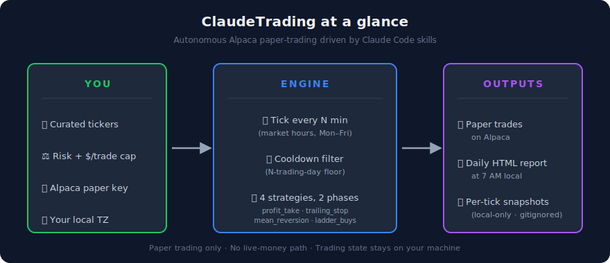
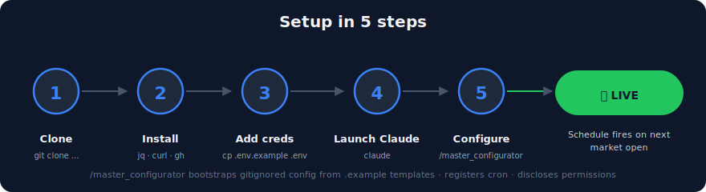

# ClaudeTrading

Autonomous Alpaca paper-trading system driven by Claude Code skills + Anthropic scheduled tasks. Clone it, point it at your own paper account, and it runs entirely on your machine.

> **Paper trading only.** Hard-coded to `https://paper-api.alpaca.markets/v2`. No live-money path exists in this repo. The shipped strategies are calibrated for an aggressive paper-trading profile and are intended as a starting point — retune via `/master_configurator` before relying on them.

## At a glance



**What you get out:** strategies that scale into positions on the way down, scale out on the way up, and protect with trailing stops — all gated behind a configurable cooldown so you stay clear of pattern-day-trader and second-income classifications. Trading state stays on your machine; nothing leaves your laptop unless you decide to back it up.

## How it works

On a configured cadence during US market hours (Mon–Fri 6:30 AM – 1:00 PM PT), a scheduled Claude session fires `/master_trading`. The skill:

1. Checks the market is open via Alpaca's `/v2/clock`.
2. Runs `safe_trading` to filter the curated pool into a **sellable set** (last buy older than 2 trading days) and a **buyable set** (last sell older than 2 trading days, or never sold). This is a configurable cooldown floor designed to keep operators clear of pattern-day-trader and second-income classifications. It is a user-tunable heuristic, **not** legal or tax advice — see disclaimer.
3. Hands those sets to each enabled strategy. Four are shipped:
   - **`profit_take`** — eager partial exit on absolute gain (sells 25% at +10/20/35/50%).
   - **`trailing_stop`** — full exit on retracement from peak.
   - **`mean_reversion`** — buys the worst basket-relative laggard (with 50-day MA falling-knife guard).
   - **`ladder_buys`** — adds to a position when it drops past a configured threshold from the last buy.
   - (`wheel` is scaffolded but disabled until Alpaca options approval.)
4. Snapshots the result locally. Trading state is **gitignored per-operator** — your pool, snapshots, and reports stay on your machine.

A separate schedule fires `/reporting` daily at 7 AM PT, producing an HTML diagnostic in `persistence/reports/`.

## Setup



`/master_configurator` does the rest: bootstraps your gitignored config files from the shipped `.example` templates, walks you through pool / risk / caps / cadence, registers the cron schedule, discloses the permission allowlist it set up. After it finishes you're done — ticks fire automatically.

### Prerequisites

**Tested on macOS, Linux, and Windows (Git Bash / MSYS).** All commands below work identically across platforms — the cross-platform shim in `lib/date.sh` handles GNU vs BSD `date`, and `lib/tz.sh` uses POSIX timezone names so it works on any OS.

| | install |
|---|---|
| `bash` ≥ 3.2 | macOS default (3.2) is sufficient. Linux: pre-installed. Windows: bundled with Git for Windows. |
| `curl` | Pre-installed on macOS, Linux, and Git Bash. |
| `jq` ≥ 1.6 | macOS: `brew install jq` · Linux: `apt install jq` (or `dnf install jq`) · Windows: `winget install jqlang.jq` |
| `gh` (optional) | macOS: `brew install gh` · Linux: see [github.com/cli/cli](https://github.com/cli/cli#installation) · Windows: `winget install GitHub.cli` |
| `coreutils` (macOS-only, optional) | `brew install coreutils` to get `gdate`. Without it, `lib/date.sh` falls back to BSD `date` with translated flags — both code paths are tested. |

### Steps

```bash
# 1. Clone
git clone https://github.com/khoks/ClaudeTrading.git
cd ClaudeTrading

# 2. Get your Alpaca paper API credentials (see "Generating Alpaca paper credentials" below)
#    Drop them in .env (which is gitignored)
cp .env.example .env
$EDITOR .env   # paste ALPACA_KEY and ALPACA_SECRET

# 3. Smoke-test the credentials
source lib/env.sh && source lib/alpaca.sh && alpaca_account | jq .status   # → "ACTIVE"

# 4. From inside Claude Code, configure & activate
claude
> /master_configurator
```

### Generating Alpaca paper credentials

If you don't already have an Alpaca paper account, you'll need one before step 2. Paper trading is free — there's no funding requirement, no SSN, no credit check. The starting balance is virtual ($100k by default).

1. **Sign up** at [alpaca.markets/signup](https://alpaca.markets/signup). Verify the email; that's it for the basic signup.
2. **Go to the Paper Trading dashboard** at [app.alpaca.markets/paper/dashboard/overview](https://app.alpaca.markets/paper/dashboard/overview).
3. **Find the "API Keys" panel** (right side of the dashboard, below the Buy/Sell widget). It shows:
   - **Endpoint:** `https://paper-api.alpaca.markets/v2` *(matches `ALPACA_BASE` in `.env.example` — no change needed)*
   - **Key:** a 20-character public identifier starting with `PK…`
   - **Regenerate** button
4. **Click "Regenerate"** to create a new Key + Secret pair. **The secret is displayed only once — copy it immediately into your `.env`.** If you lose it, just regenerate again (it invalidates any prior secret, so update `.env` if you regenerate after the system is running).
5. Paste both into `.env`:
   ```
   ALPACA_KEY=PK…              # the public key
   ALPACA_SECRET=…              # the secret shown once
   ```
   `ALPACA_BASE` and `ALPACA_DATA_BASE` already have correct paper-only defaults — leave them alone.

> If your dashboard shows a "Live Account" section instead of paper, you're on the wrong tab — switch to **Paper Trading** in the top-left account switcher (the dashboard URL should contain `/paper/`).

`/master_configurator` is the **mandatory first run** before any tick or report fires. It:

- Bootstraps your local `pool.json`, `activation.json`, `user_preferences.json`, and `.claude/settings.json` from the shipped `.example` templates (all are gitignored — your data, your machine).
- Walks you through `user_preferences_intake` (pool tickers, risk, $/trade cap), optional `user_custom_strategy_intake`, and `prebuilt_strategy_configurator` (enable/tune the prebuilt strategies). Strategy defaults shipped in `persistence/config/strategy_defaults.json` are the starting baseline.
- Registers two cron tasks via `mcp__scheduled-tasks__create_scheduled_task` and stores their IDs + your chosen cadence in `activation.json`.
- Tells you exactly what permissions were granted to scheduled-tick sessions in `.claude/settings.json` so you can review them.

`master_trading` and `reporting` both check `activation.json.configured == true` at the top of every run and exit with a clear error if you skipped the configurator.

### Viewing your portfolio: the dashboard

A live, in-browser status page with five tabs (Portfolio · Activity · Configuration · Pool · Market intel). Run:

```
> /dashboard
```

This opens `.claude/skills/dashboard/dashboard.html` in your default browser. The page **fetches live on every open and on every refresh**:

- **Alpaca paper API** for account / positions / news (CORS-supported)
- **capitoltrades.com BFF** for Congressional trades on your pool tickers (best-effort; may fail with CORS — empty-state explains)
- **File System Access API** for local configs / snapshots / pool

You can keep the tab open and just hit Refresh to re-fetch.

First-time setup is two one-time grants:

1. Paste your Alpaca paper credentials (stored in `localStorage`, sent only to Alpaca's API)
2. Pick the repo's project root via FSA (handle stored in IndexedDB)

The Configuration tab lets you **edit strategy tunables, preferences, and schedule cadence** directly in the browser — saving writes back through the same FSA handle to `persistence/config/*.json`. No PR, no skill round-trip; the files are gitignored per-operator.

**Browser support:** Chrome / Edge / Opera (Chromium) for full read+write. Firefox / Safari can read but config edits fall back to a "Download as JSON" button.

## Contributing

Changes to the repo's design, strategy skills, library code, or docs land via pull request — never directly on `main`. The `/change_management` skill (auto-nudged by a `PostToolUse` hook on tracked-file edits) creates a `change/*` branch, opens a PR, and routes the change for owner review. To check if your PR was approved, ask Claude `"is my PR approved?"` and the same skill in sync mode will fetch state and merge the branch back to `main` if the owner has merged it on GitHub.

Repo owner: run `bash .claude/skills/change_management/scripts/setup_branch_protection.sh` once to enforce the gate at the GitHub network layer.

## Documentation

- [`docs/FUNCTIONALITY.md`](docs/FUNCTIONALITY.md) — what the system does day-to-day: trading-day timeline, the cooldown safety floor, master_trading orchestration, the strategy cards, persistence, reporting, common operations.
- [`docs/ARCHITECTURE.md`](docs/ARCHITECTURE.md) — how it's built and why: layer responsibilities, tick data flow, skill catalog, state schemas, library API reference, cross-cutting concerns, design decisions.
- [`CLAUDE.md`](CLAUDE.md) — the hard rules (paper-only, must run configurator first, never commit `.env`, etc.). Loaded automatically by Claude Code.
- `.claude/skills/<name>/SKILL.md` — per-skill specs (Claude reads these as code-by-prompt at runtime).

## Repo layout

```
.claude/skills/      # 13 skills (configurator, tick, daily)
.claude/
  settings.json.example  # recommended permission allowlist for scheduled sessions
lib/                 # bash helpers: env, date (cross-platform), tz (TZ-aware cron),
                     #   alpaca, pool, calendar
persistence/
  config/
    strategy_defaults.json         # COMMITTED — shipped baseline tunables
    activation.json.example        # template; real file is gitignored
    user_preferences.json.example  # template; real file is gitignored
  pool.json.example  # template; real file is gitignored
  snapshots/         # tick (per-tick, 7-day TTL) | daily | weekly  (gitignored)
  reports/           # daily HTML reports  (gitignored)
docs/
  FUNCTIONALITY.md
  ARCHITECTURE.md
.env                 # GITIGNORED — Alpaca creds
CLAUDE.md            # rules loaded by Claude Code
```

## Security

- `.env` is gitignored. Verify with `git status` before any commit.
- Per-operator state (pool, snapshots, reports, activation, your tuned settings) is gitignored. Your trading data does not leave your machine.
- The `.claude/settings.json` allowlist that scheduled sessions use is gitignored too — `master_configurator` materialises it from `.example` on first run, scoped to the project. Review it.

## Disclaimer

The trading-day cooldown enforced by `safe_trading` is a user-defined safety margin. It is **not** legal, tax, or compliance advice and does not guarantee compliance with FINRA's pattern day trader rule, IRS classification of trading income, or any specific regulation that may apply to your visa, residency, or employment status. Consult a tax / legal advisor.

## License

MIT. Use at your own risk; no warranty. Paper-trading only — ClaudeTrading does not place live orders.
